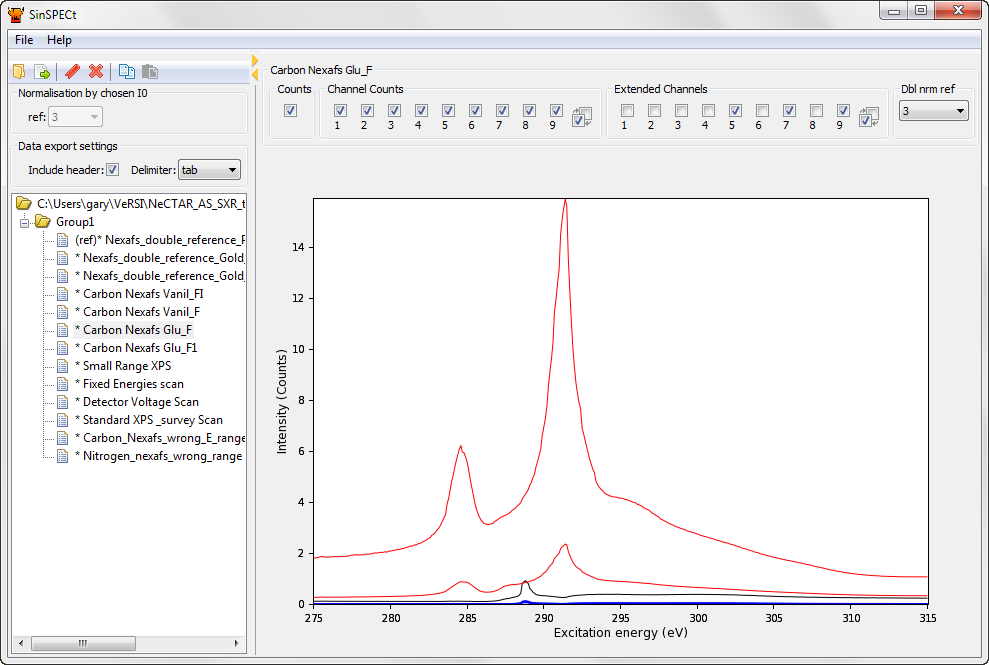

.. SinSPECt documentation master file, created by
   sphinx-quickstart on Thu Jan 31 12:19:05 2013.
   You can adapt this file completely to your liking, but it should at least
   contain the root `toctree` directive.

Welcome to SinSPECt's documentation!
====================================

SinSPECt [#sinspect_url]_ (Soft x-ray spectrum inSPECTor)
is a data explorer for Soft X-Ray spectroscopy data stored in the SPECS XML format.

- Reads SPECS XML format files saved from SpecsLab2.
- Graphical exploration of data regions.
- Exports columnar ASCII with choice of delimiter and optional headers.
- Supports normalisation of data to internally available data channels.
- Cross-platform. Runs on Windows/Mac OSX/Linux
- Released under the Modified BSD-license

Contents
--------

.. toctree::
   :maxdepth: 2

   installation
   usage
   about

Indices and tables
==================

* :ref:`genindex`
* :ref:`modindex`
* :ref:`search`

.. [#sinspect_url] `SinSPECt <http://www.synchrotron.org.au/sinspect>`_.

----

