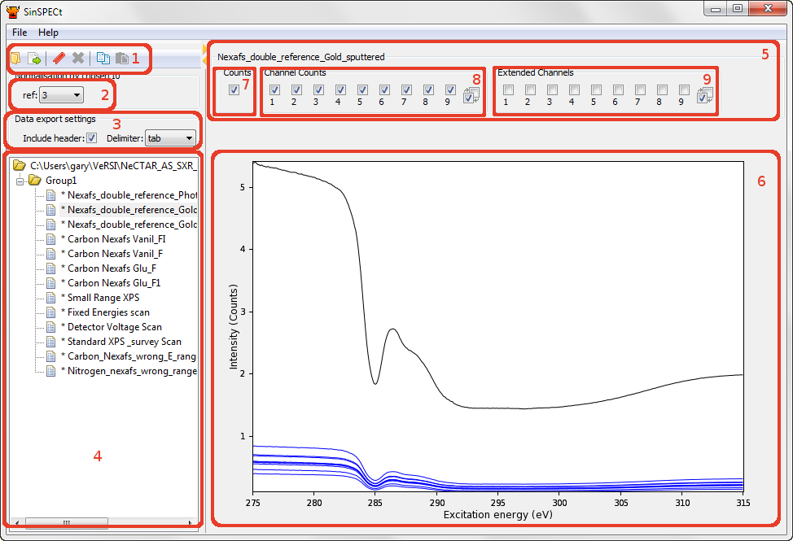

.. |degree| unicode:: U+00B0   .. degree trimming surrounding whitespace
    :ltrim:

.. _usage_root:

Usage
*****

This page describes the usage of SinSPECt.

Introduction
============

The SinSPECt window starts with two main areas, divided by a movable vertical splitter bar.
After loading a file and selecting a region, the window should look similar to that in the figure.

   SinSPECt screenshot (Windows version) identifying parts of the user interface.

The parts of the user interface are:
1. Toolbar
2. Single normalisation extended channel choice
3. Exported ASCII file format settings
4. Tree editor reflecting SPECS .xml file structure
5. Region selector panel
6. Region plot window
7. Counts (export region) checkbox
8. Channeltron channel checkboxes
9. Extended channel checkboxes

1. Toolbar.
    From left-to-right, the toolbar buttons allow you to 1a) Open a SPECS file, 1b) Export all regions marked for export, 1c) Set the region currently selected in the tree editor as the double-normalisation reference, 1d) Clear any double-normalisation reference and disable double-normalisation, 1e) Copy the Checkbox states of the currently selected region to a clipboard, 1f) Paste the clipboard state to the current tree editor selection.

    1a) Open SPECS file.

    SPECS files are organised into a 2-level hierarchy, with the possibility of multiple Groups and the possibility of multiple Regions within each group.

    .. note:: Name mangling on import

        SPECS files can potentially contain many Groups with duplicated identical naming. Within these, Regions could also be named identically. To avoid any problems that this would cause, SinSPECt alters the names to ensure uniqueness by appending sequential numbers to any duplicate. e.g. If a group contained several regions named 'a', 'b', 'c', 'a', 'b', 'a', SinSPECt would change these to 'a', 'b', 'c', 'a-1', 'b-1', 'a-2' and write files named 'a.xy', 'b.xy', 'c.xy', 'a-1.xy', 'b-1.xy', 'a-2.xy'.

    1b) Export marked regions.

    SinSPECt exports .xy files as columnar ASCII in files with names matching the Region names.
    The files are written into directories matching the Group names. Regions marked with a '*' or '+' will be exported. These correspond to those Regions whose Counts checkbox (box 7 in the figure) is checked. Initially, all regions are set to be exported, as indicated by a '*' marker.

    .. note:: A + marker indicates that the displayed and exported Counts column data is formed from a subset of the possible Channeltron Channel Counts summands. Only if all checkboxes in box 8 in the figure are checked will this marker be a '*'.

    1c) Set region as double normalisation reference.

    Clicking the bookmark toolbar button enables double normalisation and sets the currently selected region as the reference region, indicated by the text (ref) in the label alongside the reference region. When double normalisation is enabled, drop-down selectors appear to the right of the selection panel checkboxes. See the Double Normalisation section in :ref:`processing_root` for further details.

2. Single normalisation extended channel choice.
    SinSPECt operates in one of three modes: 1. No processing, 2. Single normalisation, 3. Double normalisation. SinSPECt starts in the No processing mode, indicated by this selector being set to "None". Selecting any value other than None changes the operation mode to Single normalisation and establishes the Extended Channel corresponding to the displayed number as the Single normalisation reference. Setting this to "None" returns SinSPECt to the No processing mode. The selector is disabled when operating in Double normalisation mode.

3. Exported ASCII file format settings.
    SinSPECt exports .xy files as columnar ASCII. These settings allow header columns to be disabled and the delimiter to be set.

4. Tree editor reflecting SPECS .xml file structure.
    When a SPECS file is loaded, its structure is reflected in the navigation tree structure displayed in this panel. Files may contain many Groups, each of which may contain many Regions.

5. Region selector panel.
    This panel contains any Region-related settings. Its state updates according to the Region selected in the tree editor.

6. to 9. Region plot window and Region selector panel checkboxes.
    The plot window contains plots corresponding to the checkbox states in the Region selector panel. Channeltron Channel Counts are shown in blue, their Counts sum is shown in black, and Extended Channels are shown in red. Plots are normalised according to the description in the :ref:`processing_root` section. See above note in (1b). The Channel Counts (box 8) and Extended Channels (box 9) checkbox groups also contain buttons that allow quick checking and unchecking of all checkboxes within the checkbox group.
